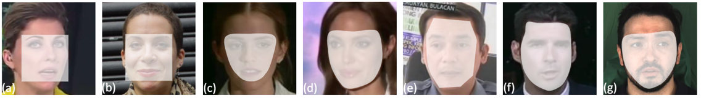
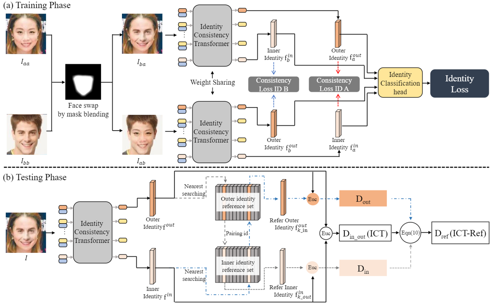
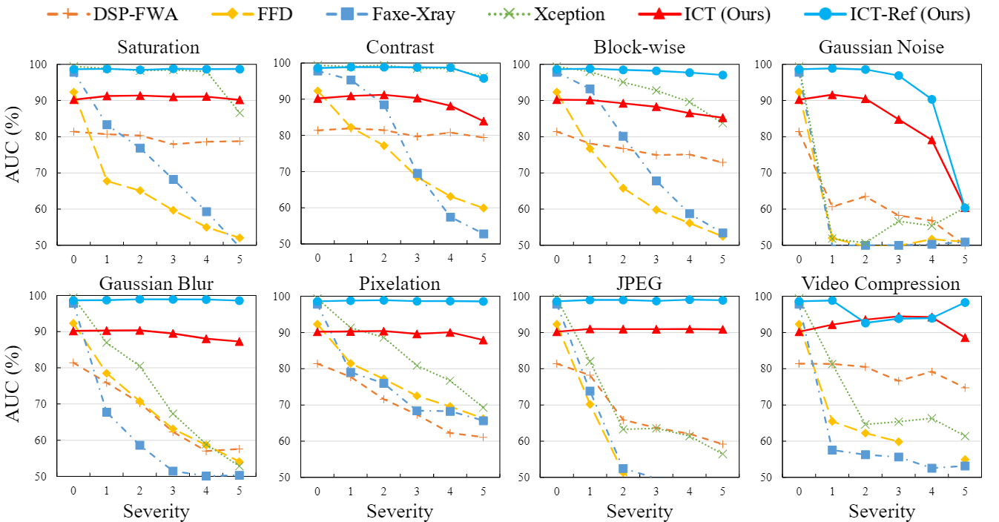

# ICT_DeepFake, CVPR2022

This repo is the official implementation of ["Protecting Celebrities from DeepFake with Identity Consistency Transformer"](https://arxiv.org/abs/2203.01318v3).

## Introduction

In this work we propose Identity Consistency Transformer(ICT), a novel face forgery detection method that focuses on high-level semantics, specifically identity information, and detecting a suspect face by finding identity inconsistency in inner and outer face regions. The Identity Consistency Transformer incorporates a consistency loss for identity consistency determination. We show that Identity Consistency Transformer exhibits superior generalization ability not only across different datasets but also across various types of image degradation forms found in real-world applications including deepfake videos. The Identity Consistency Transformer can be easily enhanced with additional identity information when such information is available, and for this reason it is especially well-suited for detecting face forgeries involving celebrities.




## Requirements

timm==0.3.4, pytorch>=1.4, opencv, ... , run:

```
bash setup.sh
```

## Data prepare

1. Follow the links below to download the datasets (you will be asked to fill out some forms before downloading):
    * [FaceForensics++ (FF++) / FaceShifter (c23)](https://github.com/ondyari/FaceForensics)
    * [DeeperForensics](https://github.com/EndlessSora/DeeperForensics-1.0)
    * [CelebDF-v2](https://github.com/yuezunli/celeb-deepfakeforensics)

2. Download the RenitaFace [ResNet50](https://drive.google.com/drive/folders/1oZRSG0ZegbVkVwUd8wUIQx8W7yfZ_ki1) and move it to `PRETRAIN/ALIGN`.

3. Extract faces from videos and align them.
    ```
    python -u preprosee.py
    ```
   This is a simple example, modify the input/output path for different datasets.

   We also provide an aligned subset of [FF++](https://drive.google.com/file/d/1TT_rce53APTw2m6BzCNo-xv7bfUqQql0/view?usp=sharing) test set, which contains 20K real faces and 20K fake faces (from DeepFake part and FaceSwap Part). Extract the zip file and move it to `DATASET/FF` for fast evaluation.

## Evaluate

1. Download our pretrained [ICT Base](https://github.com/LightDXY/ICT_DeepFake/releases/download/v0.1.0/ICT_Base.pth) and move it to `PRETRAIN/ICT_BASE`. For the ICT-Reference, download our already bulit [reference set](https://github.com/LightDXY/ICT_DeepFake/releases/download/v0.1.0/ref.pkl) and move it to `PRETRAIN/ICT_BASE`.

2. Run the test script.
```
   bash ict_test.sh
      --name           pretrain model name
      --aug_test       test robustness toward different image aumentation
```
We provide 7 image-level augmentation methods, each has 5 intensity levels, most of them are from [DeeperForensics](https://github.com/EndlessSora/DeeperForensics-1.0) except the JPEG compression, the ``jpeg`` is DeeperForensics is ``Pixelation``, so we provide ``JPEG_REAL`` to evaluate the robustness toward JPEG compression

The robustness evaltuation log on FF++ could be found [here](https://github.com/LightDXY/ICT_DeepFake/releases/download/v0.1.0/ff_eval.log)



# TODO


- [x] Release inference code.
- [ ] Release training code.


# Acknowledgments

This code borrows heavily from [TreB1eN/InsightFace_Pytorch](https://github.com/TreB1eN/InsightFace_Pytorch).

The ViT model is modified from [DEiT](https://github.com/facebookresearch/deit)

The face detection network comes from [biubug6/Pytorch_Retinaface](https://github.com/biubug6/Pytorch_Retinaface).


# Citation
If you use this code for your research, please cite our paper.
```
@article{dong2022ict,
  title={Protecting Celebrities from DeepFake with Identity Consistency Transformer},
  author={Dong, Xiaoyi and Bao, Jianmin and Chen, Dongdong and Zhang, Ting and Zhang, Weiming and Yu, Nenghai and Chen, Dong and Wen, Fang and Guo, Baining},
  journal={arXiv preprint arXiv:2203.01318},
  year={2022}
}
```

